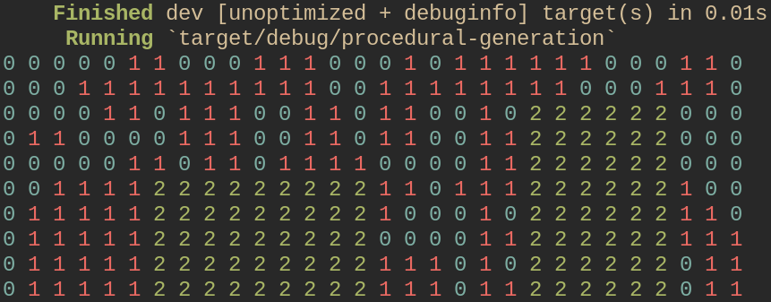

# Procedural Generation

This is a crate for for procedurally generating maps written in Rust.
It's very elegant to use, see the example below:

```rust
use procedural_generation::Generator;

fn main() {
    Generator::new()
        .with_size(5, 10)
        .spawn_terrain(1, 5)
        .spawn_terrain(2, 3)
        .show();
}
```

Produces the following (prints with colors in terminal!):


